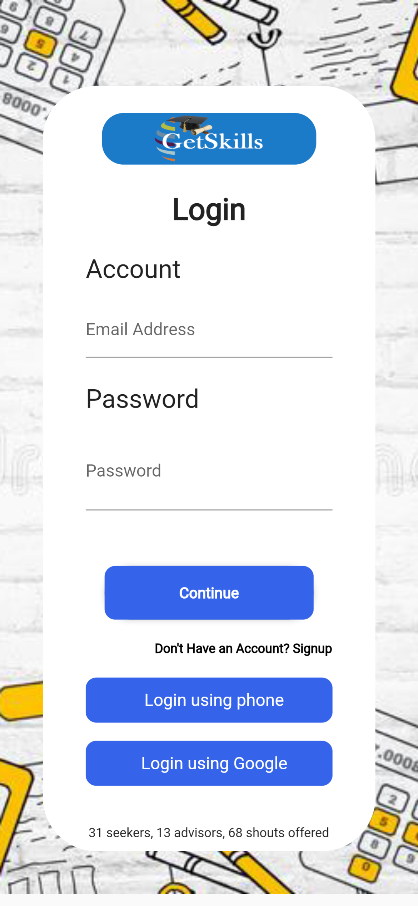
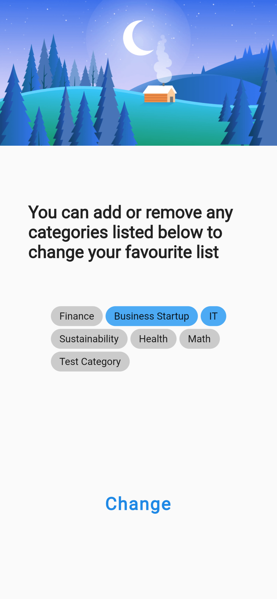
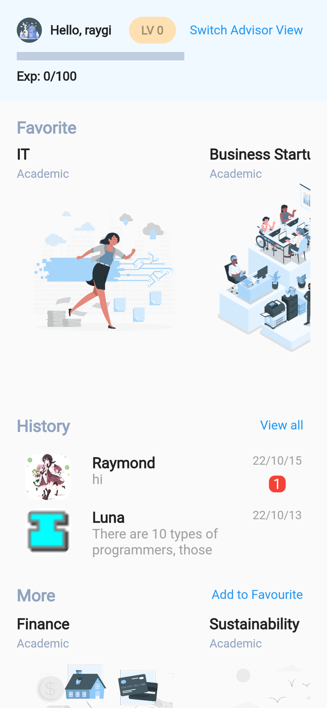
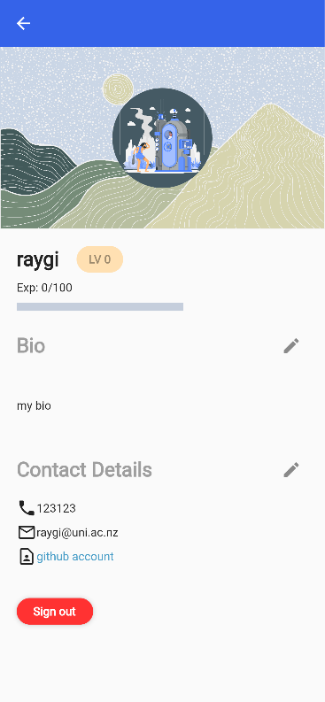
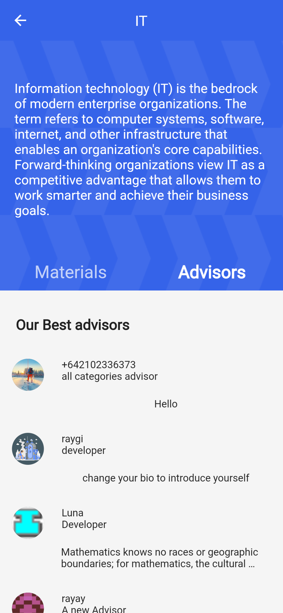
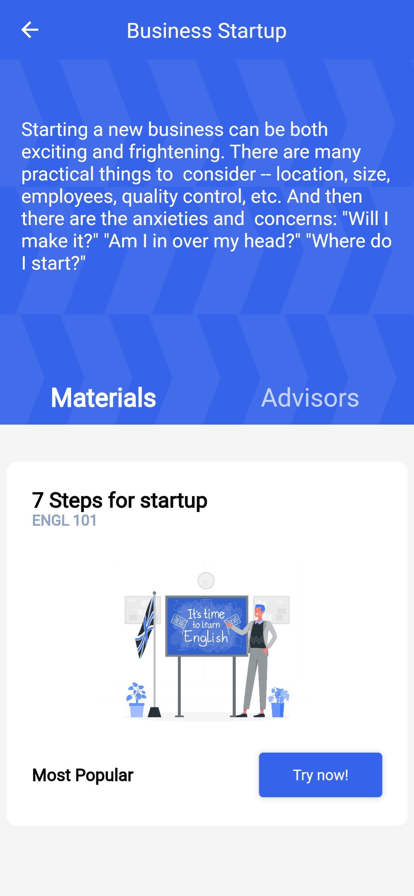
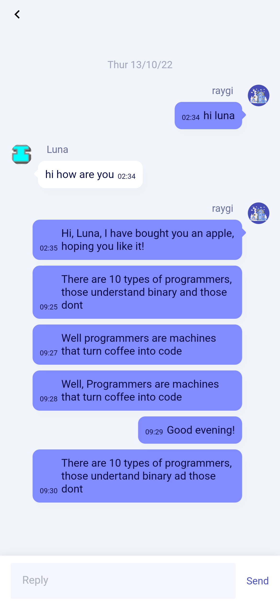
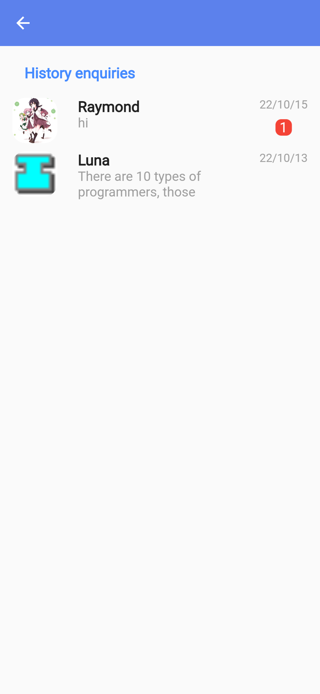

# SOFTENG 761 Group 8  _GetSkills - Seekers and Advisors_

## Introduction
 

More than just an application, **GetSkills seekers and advisors** is the manifestation of a desire to build a connection between seekers and advisors, a channel through which knowledge from prestigious experts can reach those seeking to know, to learn, to absorb. 

In order to realise this vision, an app that can provide a platform where the latters - seekers - can find the former - advisors - with both ease and, hopefully, compatability, has been designed with a most fundamental function, that is to faciliate productive and effectvie communication. That app is our **GetSkillsApp**.

Github Repo link: https://github.com/University-of-Auckland-SOFTENG761/project-project-group-8

---
- Currently, **GetSkillsApp** targets university students
- The application has 3 main views designed for different user types, which are [**Seeker**](#seeker-view), [**Advisor**](#advisor--admin-view) and [**Admin**](#advisor--admin-view) views.

- By default, both Seekers and Advisors will be directed to the shared [**Home screen**](#seeker-view) after logged in.
	- If the account is an **advisor**, the user can switch to the [**Advisor view page**	](#advisor--admin-view) by clicking the "*Switch Advisor View*" button.
	- If a **seeker** click the "*Switch Advisor View*" button, they will be directed to the advisor application process 

- To faciliate the Advisor application process, a special user type - **admin** - is needed. Logging in using an admin account will navigate the user to a special  [**Admin page (for managing advisors**)](#advisor--admin-view). Here the user can either accept or reject the advisor application form.

- Some Exsiting Example accounts (or can register for new accounts)
  - Seeker accounts
      email: seeker1@uni.ac.nz and seeker2@uni.ac.nz
  - Advisor accounts
      email: advisor1@uni.ac.nz and advisor2@uni.ac.nz
  - Password for above accounts are 123456
  - Admin Account to approve or deny advisor applications
  	email: admin@uni.ac.nz, password: 123123

---

## Setup and Application environment

### Prerequisites

- Clone this repository to your local machine. More information on how to do this can be found [here](https://docs.github.com/en/repositories/creating-and-managing-repositories/cloning-a-repository).

- Install the latest version of Flutter from [here](https://docs.flutter.dev/get-started/install).
  - Ensure, running `flutter --version`, that the version is greater than 3.0.
  - Ensure, running `flutter doctor`, that all checked items are pass.

- If you want to run on an Android emulator, please install the latest version of Android Studio from [here](https://developer.android.com/studio).
  - Create an Andriod emulater by Android Studio.

### Getting Started

In order to run the application, follow these steps.

- Install all dependencies, run `flutter pub get` and wait for successful installation.

- Run on local
  - Open your terminal and set the working directory to the cloned project on your local machine.
  - Run `flutter run -d chrome` in your terminal to run the web application on Chrome.
  - Run `flutter run -d [name of your Android emulator]` to start the Android application on emulator.

- URL entrance
  - Access <https://gs-apps-1b33b.firebaseapp.com> or <https://gs-apps-1b33b.web.app> to get web application.

- Run on Android mobile
  - Go to Github Repo Release "V1" and download corresponding apk file on your phone to install them.
  https://github.com/University-of-Auckland-SOFTENG761/project-project-group-8/releases/tag/V1
---

## Build and Deployment information

### CI/CD Pipeline

> This project uses Github Action to build and deploy the application to Firebase Hosting when there is a push to the master branch.
>
> The build files of the Action can be downloaded from corresponding action artifacts. The retentation time of the artifacts is one day.

### Build Manually

To build the project manually, follow these steps.

- Web:
  - Run `flutter build web` in the root directory of the project.
  - The build files will be generated in the `build/web` directory.

- Android:
  - Run `flutter build apk  --split-per-abi` in the root directory of the project.
  - The build files will be generated in the `build/app/outputs/apk/release` directory.

- IOS:
  - Run `flutter build ios --release --no-codesign` in the root directory of the project.
  - The build files will be generated in the `build/ios/iphoneos` directory.

---

## Screenshots

### Seeker view

| Login/Signup page                          | Interest selection page                        | Home screen                                 |
| ------------------------------------------ | ---------------------------------------------- | ------------------------------------------- |
|           |  |             |
| Seeker profile page                        | Category detail page (Advisors)                | Category detail page (Resources)            |
|  |    |  |
| Chat page                                  | Chat history page                              |                                             |
|            |        |                                             |

### Advisor & Admin view

| Advisor detail page                        | Advisor view page                           | Admin page (for managing advisors) |
| ------------------------------------------ | ------------------------------------------- | ---------------------------------- |
| |  |             |

---

## Testing

- Several Integration Test Sets are implemented and placed at the "test" folder. To run these tests, please use the correct ChromeDriver.exe that suits the local Chrome version installed in your device. To check chrome version can refer to this link: https://www.digitalcitizen.life/version-google-chrome/. For systems other than windows, refer to this link to download correct version: https://chromedriver.chromium.org/downloads

- Then, open folder "test_driver/ChromDriver{Your version of Chrome}",  run `chromedriver --port=4444` to start chromedriver on local host. See below figure

- To run integration test scripts, open another command line terminal on root directory, run `flutter drive \ --driver=test_driver/integration_test.dart \ --target=test/{Desired test script name} \ -d chrome`. See red arrow in below figure. A chrome window will be opened and automatically run the written scripts; see green arrow in below figure. The test resulst will be shown in the console as blue arrow in below figure.

---

## Contributors

- **Raymond Li (Scrum Master) - [rli948]**
  - Sprint Planning and mangage agile process
  - Frontend Firebase design on Figma
  - Manage product backlog and user stories
  - Setup User Model in Databse
  - Implement the Select Interest Page
  - Implement the Advisor application Page
  - Implement the Admin Page Backend APIs
  - Implement Advisor Header widget
  - Automation Testing on Advisor and Admin Pages
  - Code Refactoring and file restructuring
  

- **Siwei Yang - [syan553]**
  - Implement the chat page
  - Design the chat models and logic
  - Set up and configure the CI/CD pipeline
  - Fix image display issue on the login page
  - Implement the logout function
  - Refactor avatar to a separate widget
  - Sync the avatar to advisor profile
  - Fix infinite scroll issue on the category detail page
  - Implement seeker view test
  - Fix scroll/render/overflow issues on many pages

- **Qunzhi Zhou - [qzho236]**
  - Design architecture and domain model
  - Build up User Portfolio Page
  - Build up Advisor Detail page and backend endpoints
  - Build up "Buy something to advisor" pop up functionality
  - Build up Category Detail Material page(Cards & endpoints)

- **Jiayou Yao - [jyao244]**
  - Design the UML diagram
  - Setup the user model
  - Implement the login & signup page
  - Implement the third party login (Google & phone)
  - Implement the signup email verification
  - Implement the administration page

- **Johnny Zheng - [yzhe819]**
  - Finish the wireFrame and UI design with Raymond
  - Design system level architecture
  - Set up the development environment and configuration
  - Implement the function of recording the login status
  - Implement the main home screen
  - Implement the user portfolio page
  - Used firebase storage to record all the media item
  - Fix image render error

- **Leon Wang - [zwan865]**
  - Build up the chat list
  - Implement the backend of chat function
  - Implement the user profile editing function
  - Implement the global state management
  - Implement the backend of advisor function
  - Refactor the file construction

- **Dex - [pduy110]**
  -  Build up Category Detail page
  - Redesign Category Detail page to be more responsive
  - Build up Material Card
  - Build up Advisor Card
  - Fix avatar position in Seeker Portfolio
  - Implement User background
  - Sync the user background to user profile

## Application Implementation Details
### Use case diagram

### Architecture diagram

### UML diagram

